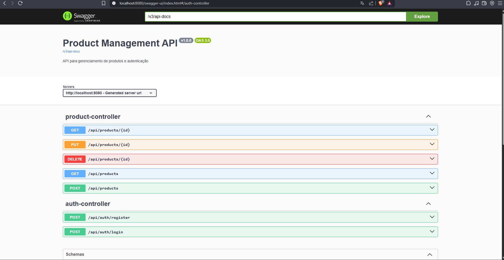

# Product Management API

[](https://www.oracle.com/java/technologies/javase/jdk17-archive-downloads.html)
[](https://spring.io/projects/spring-boot)
[](https://maven.apache.org/)
[](https://www.postgresql.org/)
[](https://www.docker.com/)
[](https://jwt.io/)
[](http://localhost:8080/swagger-ui.html)

API REST para gerenciamento de produtos com autenticação stateless via JWT, cadastro e login de usuários, persistência em PostgreSQL e documentação interativa com Swagger.

O projeto foi construído com Spring Boot e expõe um fluxo simples e direto:

- cadastro de usuário com papel `USER` ou `ADMIN`
- login com geração de token JWT
- CRUD completo de produtos
- listagem paginada de produtos
- validação de payloads com retorno `422` para dados inválidos
- documentação OpenAPI pronta para teste manual

> Hoje os endpoints protegidos exigem autenticação, mas não há regras diferentes por papel nas rotas de produto.



## O que a API entrega

### Autenticação

- `POST /api/auth/register` cria um usuário e já retorna um JWT
- `POST /api/auth/login` autentica por e-mail e senha e retorna um JWT

### Produtos

- `POST /api/products` cria produto
- `GET /api/products` lista produtos com paginação
- `GET /api/products/{id}` busca produto por id
- `PUT /api/products/{id}` atualiza produto
- `DELETE /api/products/{id}` remove produto

Cada produto possui os campos:

- `id`
- `name`
- `description`
- `price`
- `stock`
- `createdAt`
- `updatedAt`

## Stack

- Java 17
- Spring Boot 3.5.7
- Spring Web
- Spring Data JPA
- Spring Security
- Spring Validation
- SpringDoc OpenAPI / Swagger UI
- PostgreSQL
- JWT com `jjwt`
- Lombok
- Maven
- Docker e Docker Compose
- H2 para testes

## Como executar

### Opção 1: Docker Compose

Sobe a API e o PostgreSQL juntos.

```bash
docker-compose up -d --build
```

A aplicação ficará disponível em `http://localhost:8080`.

Serviços criados:

- API: `http://localhost:8080`
- PostgreSQL: `localhost:5432`

### Opção 2: execução local

Pré-requisitos:

- Java 17
- PostgreSQL rodando localmente

Configuração padrão esperada pela aplicação:

- banco: `productdb`
- usuário: `postgres`
- senha: `postgres`

Esses valores estão em `src/main/resources/application.properties` e podem ser sobrescritos por variáveis de ambiente.

Para iniciar:

```bash
./mvnw spring-boot:run
```

No Windows:

```powershell
.\mvnw.cmd spring-boot:run
```

## Variáveis principais

Configurações default do projeto:

```properties
spring.datasource.url=jdbc:postgresql://localhost:5432/productdb
spring.datasource.username=postgres
spring.datasource.password=postgres
server.port=8080
security.jwt.expiration-ms=3600000
```

O projeto já aceita sobrescrita por ambiente, por exemplo:

- `SPRING_DATASOURCE_URL`
- `SPRING_DATASOURCE_USERNAME`
- `SPRING_DATASOURCE_PASSWORD`
- `SPRING_JPA_HIBERNATE_DDL_AUTO`

## Documentação da API

Com a aplicação em execução:

- Swagger UI: [http://localhost:8080/swagger-ui.html](http://localhost:8080/swagger-ui.html)
- OpenAPI JSON: [http://localhost:8080/v3/api-docs](http://localhost:8080/v3/api-docs)

## Fluxo de autenticação

1. Crie um usuário em `POST /api/auth/register`.
2. Copie o token retornado.
3. Envie o token no header `Authorization` para acessar `/api/products`.

```http
Authorization: Bearer SEU_TOKEN_JWT
```

## Exemplos de payload

### Registro

```json
{
  "name": "Felipe",
  "email": "felipe@example.com",
  "password": "123456",
  "role": "ADMIN"
}
```

### Login

```json
{
  "email": "felipe@example.com",
  "password": "123456"
}
```

### Criação de produto

```json
{
  "name": "Notebook Pro 14",
  "description": "Notebook para uso profissional",
  "price": 6499.90,
  "stock": 12
}
```

### Resposta de autenticação

```json
{
  "token": "eyJhbGciOiJIUzI1NiJ9..."
}
```

## Paginação

`GET /api/products` usa `Pageable` do Spring e aceita parâmetros como:

- `page`
- `size`
- `sort`

Exemplo:

```http
GET /api/products?page=0&size=10&sort=name,asc
```

## Validações e erros

A API possui tratamento global para:

- `404 Not Found` quando um recurso não existe
- `422 Unprocessable Entity` quando o payload falha em validação

Regras de validação já implementadas:

- `email` deve ser válido
- `name` é obrigatório
- `price` deve ser maior ou igual a `0`
- `stock` deve ser maior ou igual a `0`
- `description` aceita no máximo `500` caracteres

Exemplo de erro de validação:

```json
{
  "status": 422,
  "error": "Validation Error",
  "message": "Dados inválidos",
  "timestamp": "2026-01-01T10:00:00Z",
  "fieldErrors": [
    {
      "field": "price",
      "message": "must be greater than or equal to 0.0"
    }
  ]
}
```

## Testes

Os testes usam H2 em memória e cobrem:

- carregamento do contexto Spring
- regras de cadastro de usuário
- regras principais do serviço de produtos

Para executar:

```bash
./mvnw test
```

No Windows:

```powershell
.\mvnw.cmd test
```
